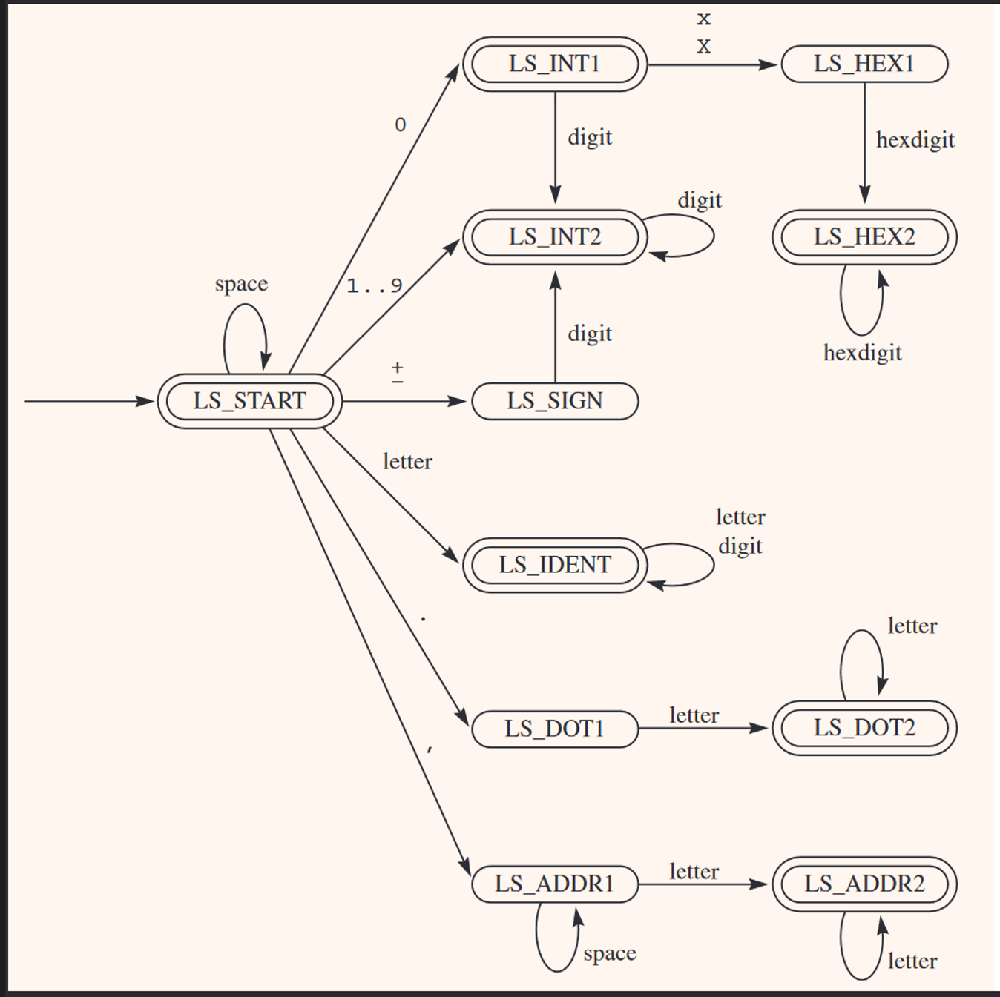

# Lexycal Analyzer
    A simple lexycal analyzer for an assembler project;

## FSM Design
    

## Components:
### InBuffer
    - the input string handler;
    - has the ability to advance and backup the input;
    
### Tokenizer
    - gets a line of characters, given by the InBuffer, loops through each line (with the getToken() function) detecting and returning each token until the end of the input string;
